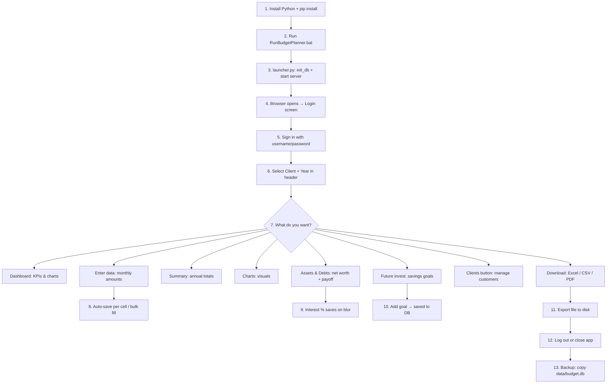

# Annual Budget Planner

Local web app for **annual household or business budgets** per **client** and **calendar year** (2025–2040).  
All data stays on your PC in SQLite — no cloud required.

---

## Table of contents

1. [Installation](#installation)
2. [How to run](#how-to-run)
3. [Login (username & password)](#login-username--password)
4. [Application flow (first → last)](#application-flow-first--last)
5. [Where data is stored](#where-data-is-stored)
6. [Database tables (what each stores)](#database-tables-what-each-stores)
7. [Project structure (files & folders)](#project-structure-files--folders)
8. [Configuration (.env)](#configuration-env)
9. [Main UI tabs](#main-ui-tabs)
10. [Commands reference](#commands-reference)
11. [Desktop .exe build](#desktop-exe-build)
12. [Troubleshooting](#troubleshooting)

---

## Installation

**Requirements:** Windows 10/11, Python 3.11+ (3.12 recommended).

```powershell
cd d:\Finance\Budget_Planner

# 1. Create virtual environment (once)
python -m venv .venv

# 2. Activate it
.\.venv\Scripts\activate

# 3. Install dependencies
pip install -r requirements.txt

# 4. Optional: copy environment template
copy .env.example .env
```

| Package | Purpose |
|---------|---------|
| `fastapi` + `uvicorn` | Web API and local server |
| `openpyxl` | Excel import/export |
| `fpdf2` + `matplotlib` | PDF reports with charts |
| `pytest` + `httpx` | Automated tests |

---

## How to run

| Method | What to do |
|--------|------------|
| **Easiest** | Double-click `RunBudgetPlanner.bat` or `start_budget.bat` |
| **Manual** | `python launcher.py` |
| **Developer** | `python -m uvicorn app.main:app --host 127.0.0.1 --port 8765` |

Then open **http://127.0.0.1:8765** in your browser.

After code updates, press **Ctrl+F5** (hard refresh) so new `app.js` / `styles.css` load.

**Stop the app:** close the black launcher/console window.

---

## Login (username & password)

On **first run**, the app creates `data/auth.json` with a hashed password (plain text is never stored).

### Default credentials (first install)

If you do **not** set environment variables before the first start:

| Field | Default value |
|-------|----------------|
| **Username** | `duggireddy` |
| **Password** | `gangaBabu$208` |
| **Reset code** (change password) | `12345` |

### Set your own credentials before first run

Create or edit `.env` in the project root **before** starting the app the first time:

```ini
BUDGET_AUTH_USER=your_username
BUDGET_AUTH_PASSWORD=your_secure_password
BUDGET_RESET_CODE=your_reset_code
```

Then start the app once. Credentials are written to `data/auth.json` as hashes.

### Change password later

1. Sign in → **Profile** (top right) → **Change password**
2. Enter reset code + new password (and optional new username)

### Auth file location

| File | Contents |
|------|----------|
| `data/auth.json` | Hashed username, password, reset code (do not edit by hand) |

To reset login completely: stop the app, delete `data/auth.json`, set `.env` if needed, restart.

---

## Application flow (first → last)

High-level order of what happens when you use the app:



### Step-by-step (recommended workflow)

| Step | Action | First / last |
|------|--------|--------------|
| **1** | Install dependencies | **First** (once) |
| **2** | Run `RunBudgetPlanner.bat` | Each session start |
| **3** | Sign in | Each session start |
| **4** | Pick **Client** + **Year** | Before any data work |
| **5** | **Clients** (header): create client if new | First time per customer |
| **6** | **Enter data**: type monthly budget amounts | Core data entry |
| **7** | **Dashboard / Summary / Charts**: review totals | After data entered |
| **8** | **Assets & Debts**: assets, loans, interest % | Optional snapshot |
| **9** | **Future invest**: savings goals & projections | Optional planning |
| **10** | **Recalculate** / **Download** (bottom right) | Export when needed |
| **11** | **Profile → Log out** or close launcher | **Last** (end session) |
| **12** | Copy `data/budget.db` to backup | **Last** (protect data) |

---

## Where data is stored

```
Client (profile: name, address, tax ID, …)
  └── Budget per year (2025 … 2040)
        └── 12 months × each budget line (amount per category)
  └── Assets & debts (per client, not per year)
  └── Future investment goals (per client)
```

| File / folder | What it holds |
|---------------|----------------|
| **`data/budget.db`** | **Main database** — clients, budgets, monthly entries, assets, debts, future goals, custom lines, import log |
| **`data/auth.json`** | Login hashes (username / password / reset code) |
| **`.env`** | Optional settings (DB backend, auth env vars) — not budget numbers |
| **`dist/BudgetPlanner/`** | Built Windows app (after `build_exe.bat`); uses `data/` next to the `.exe` |

**Backup:** copy `data/budget.db` (and optionally `data/auth.json`).

**Reset all budget data:** delete `data/budget.db` and restart (sample client is recreated if DB is empty).

---

## Database tables (what each stores)

All tables live inside **`data/budget.db`** (SQLite).

| Table | Stores |
|-------|--------|
| `clients` | Customer profile: name, company, address, email, phone, tax/VAT ID, IBAN, notes |
| `budgets` | One row per **(client_id, year)** — settings such as Monatlich mode |
| `entries` | **line_key + month (1–12) + amount** for that budget year |
| `custom_lines` | User-added budget rows per section (per budget year) |
| `client_assets` | Asset name, type, current value (balance sheet) |
| `client_debts` | Debt name, outstanding, monthly payment, **interest % p.a.** |
| `client_future_investments` | Savings goals: current, target, monthly contribution, return %, target year |
| `category_mappings` | Excel import: map file labels → budget line keys |
| `import_log` | History of imports |

---

## Project structure (files & folders)

```
Budget_Planner/
├── RunBudgetPlanner.bat      # Start app (recommended)
├── start_budget.bat          # Alternative starter
├── build_exe.bat             # Build Windows desktop folder
├── run_tests.bat             # Run pytest
├── launcher.py               # Starts uvicorn + opens browser + init_db
├── requirements.txt          # Python dependencies
├── .env.example              # Template for .env
├── .env                      # Your local settings (not in git)
│
├── data/                     # YOUR DATA (created on first run)
│   ├── budget.db             # SQLite database (all budget & client data)
│   └── auth.json             # Login credentials (hashed)
│
├── app/                      # Backend (Python)
│   ├── main.py               # FastAPI routes, auth middleware, API
│   ├── database.py           # SQLite/MySQL, CRUD, balance sheet
│   ├── auth.py               # Login, sessions, password change
│   ├── categories.py         # All budget line definitions (Excel template)
│   ├── calculations.py       # Totals, difference, summaries, charts data
│   ├── debt_payoff.py        # Interest/month, months to clear debts
│   ├── future_invest.py      # Future investment projections
│   ├── seed.py               # Sample client + demo months on empty DB
│   ├── paths.py              # Dev vs PyInstaller paths
│   ├── import_excel.py       # Parse .xlsx uploads
│   ├── import_csv.py         # Parse CSV uploads
│   ├── export_excel.py       # Download .xlsx
│   ├── export_csv.py         # Download .csv
│   ├── export_pdf.py         # Download .pdf (charts + balance)
│   └── export_pdf_charts.py  # Chart images for PDF
│
├── static/                   # Frontend (browser UI)
│   ├── index.html            # Page layout, tabs, forms
│   ├── app.js                # UI logic, API calls, tabs, balance/future panels
│   ├── styles.css            # Layout, header, tabs, tables
│   ├── i18n.js               # English / German texts
│   ├── currency.js           # EUR / USD / GBP display
│   └── vendor/               # Chart.js library
│
├── tests/                    # Automated tests (~80 tests)
│   ├── conftest.py           # Test DB + auth setup
│   ├── test_auth.py
│   ├── test_calculations.py
│   ├── test_future_invest*.py
│   ├── test_debt_payoff.py
│   └── …
│
└── dist/BudgetPlanner/       # After build: BudgetPlanner.exe + bundled files
```

### What each main code file does

| File | Role |
|------|------|
| `launcher.py` | Entry point: set `data/`, run `init_db()`, start server on port **8765**, open browser |
| `app/main.py` | REST API: budget, clients, assets, debts, future investments, import/export |
| `app/database.py` | All SQL; `compute_balance_sheet()` joins assets, debts, payoff, future plan |
| `app/categories.py` | Income/expense line keys and DE/EN labels (matches Excel template) |
| `static/app.js` | Single-page app: tabs, grids, live debt math, future invest forms |
| `static/index.html` | HTML shell: header, tabs, panels |

---

## Configuration (.env)

Copy `.env.example` to `.env`:

```ini
# Database (default: local SQLite)
DB_BACKEND=sqlite

# Optional: only used when creating auth.json on FIRST run
BUDGET_AUTH_USER=your_username
BUDGET_AUTH_PASSWORD=your_password
BUDGET_RESET_CODE=12345

# Optional MySQL (needs Docker)
# DB_BACKEND=mysql
# MYSQL_HOST=127.0.0.1
# MYSQL_PORT=3306
# MYSQL_USER=budget
# MYSQL_PASSWORD=budget
# MYSQL_DATABASE=budget_app
```

Do **not** run `MYSQL_USER=budget` in PowerShell — that is shell syntax for Linux. Use `.env` only.

---

## Main UI tabs

| Tab | Purpose |
|-----|---------|
| **Dashboard** | KPIs, balance, spending donut, revenue vs expenses |
| **Enter data** | 12-month grid per category (auto-save) |
| **Summary** | Annual table: all section totals + difference |
| **Charts** | Visual breakdown for selected month/year |
| **Assets & Debts** | Net worth, debt interest, payoff timeline |
| **Future invest** | Savings goals with projections |
| **Clients** (header button) | Create/edit/delete clients, open client budget |
| **Profile** | Monthly calculation mode, change password, log out |
| **Flags** | English / Deutsch |
| **Currency** | Display format (EUR, etc.) — no FX conversion |

Bottom right: **Recalculate totals**, **Download** (Excel, CSV, PDF).

---

## Commands reference

| Action | Command |
|--------|---------|
| Install | `pip install -r requirements.txt` |
| Run app | `RunBudgetPlanner.bat` or `python launcher.py` |
| Run tests | `python -m pytest tests/ -v` or `run_tests.bat` |
| Build .exe | `build_exe.bat` |
| Backup data | Copy `data\budget.db` |
| Reset DB | Delete `data\budget.db`, restart app |
| Reset login | Delete `data\auth.json`, restart (respect `.env` on first run) |

---

## Desktop .exe build

1. Run **`build_exe.bat`** (runs tests, then PyInstaller).
2. Copy folder **`dist\BudgetPlanner\`** to PC or USB.
3. Double-click **`BudgetPlanner.exe`**.

| Item | Location |
|------|----------|
| Program | `dist\BudgetPlanner\BudgetPlanner.exe` |
| Your data | `data\budget.db` next to the `.exe` |
| URL | http://127.0.0.1:8765 |

Keep the whole `BudgetPlanner` folder together.

---

## Troubleshooting

| Problem | Fix |
|---------|-----|
| App won’t start | Check `.venv` exists; `pip install -r requirements.txt` |
| Login fails | Delete `data/auth.json`, set `.env` auth vars, restart once |
| Old UI / buttons don’t work | **Ctrl+F5** in browser |
| Port 8765 in use | Close other terminal; or use `start_budget.bat` (frees port) |
| Future invest won’t save | Restart app (creates `client_future_investments` table); **Ctrl+F5** |
| Interest always 0% | Enter **Interest % p.a.** in **Debts** table, tab out to save |
| Wrong year empty | Normal — each year is separate; use **Enter data** or import |
| Corrupt database | Delete `data/budget.db`, restart (sample data if empty) |

---

## Excel template categories

Full list is in `app/categories.py` (income, living, housing, insurance, savings, etc.).  
**Difference** = Total revenue − Total expenses (computed automatically).

Sample data: first run with empty DB creates **Sample Client** with Jul–Dec demo amounts (`app/seed.py`).
